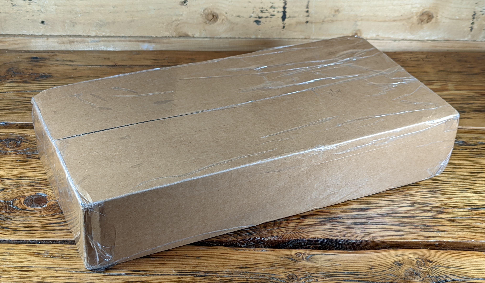
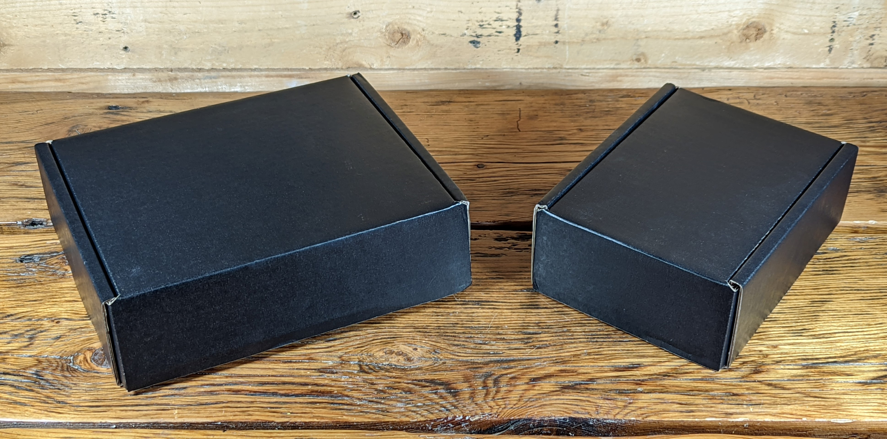
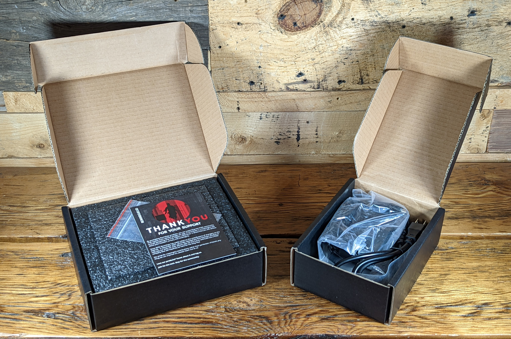
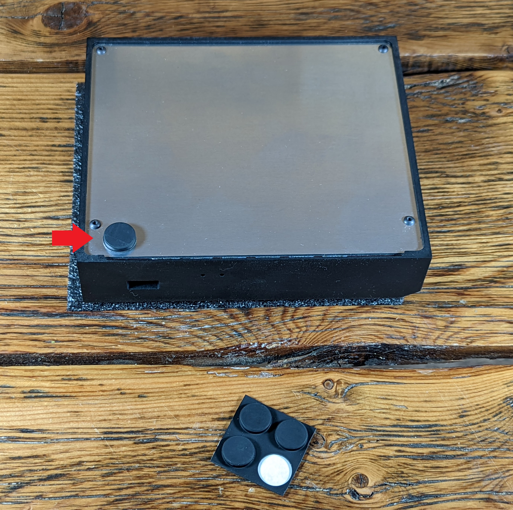
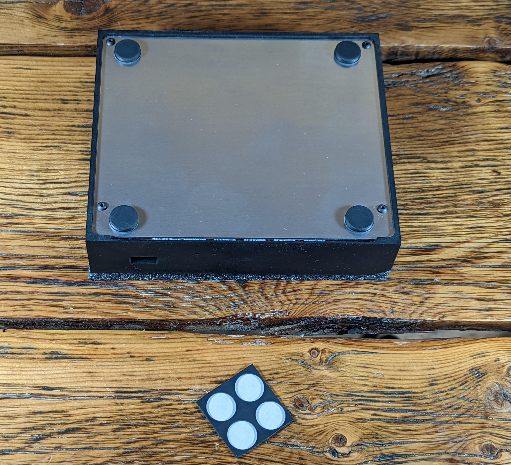

# Unboxing
The Tanto ships in an inconspicuous brown box with no logos, stickers, or anything indicating that there are Bitcoin related contents within. The box measures 8cm x 20cm x 40cm and weighs a little more than 1kg.

  
 

 
 Inside the brown box are two black boxes, these contain everything that is included. 
 
 

  
  
 

 
You can flip the Tanto over and apply the adhesive rubber feet to the four corners of the bottom plate. 

 

  
  
 

 
Then you are ready to connect the Tanto.  
