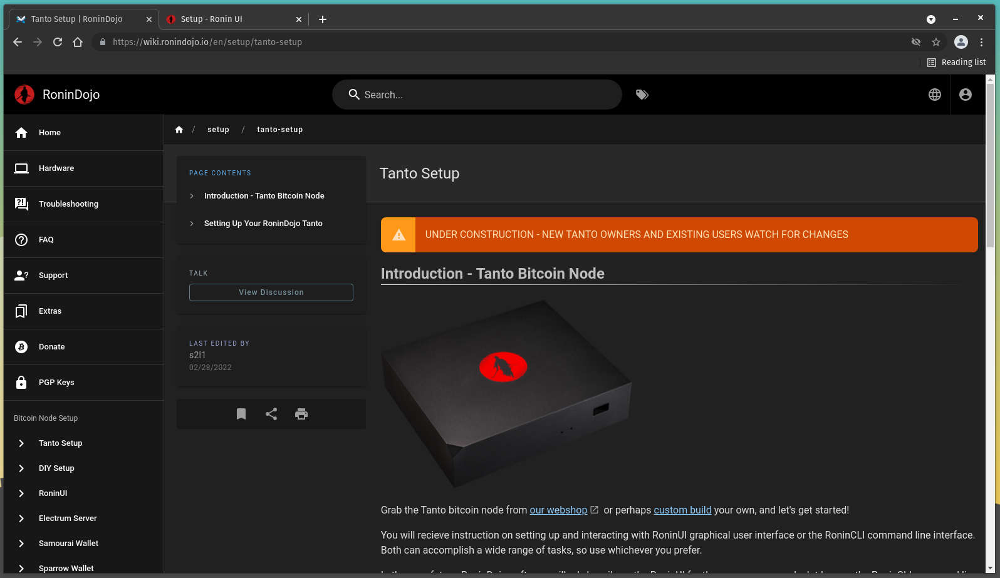
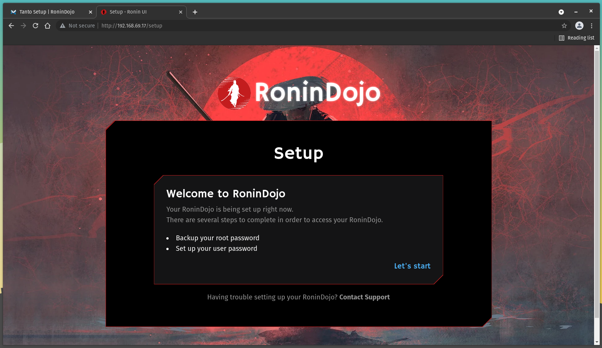
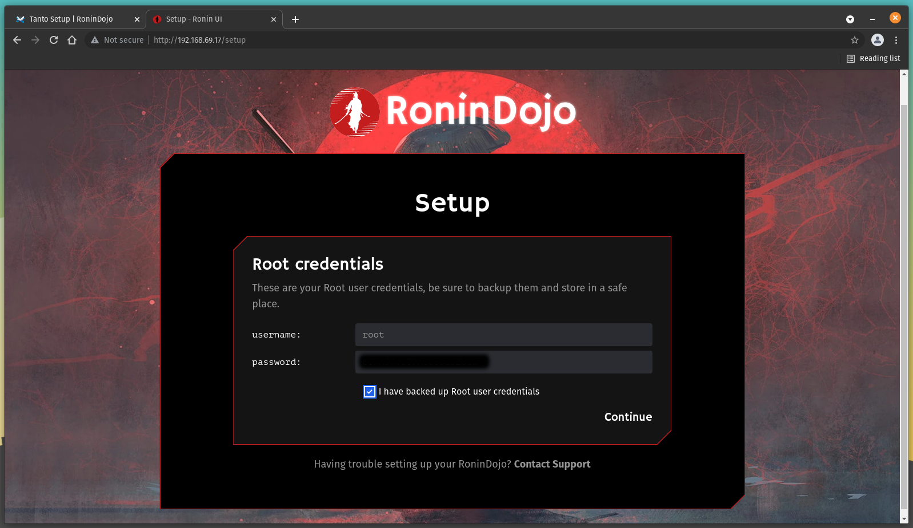
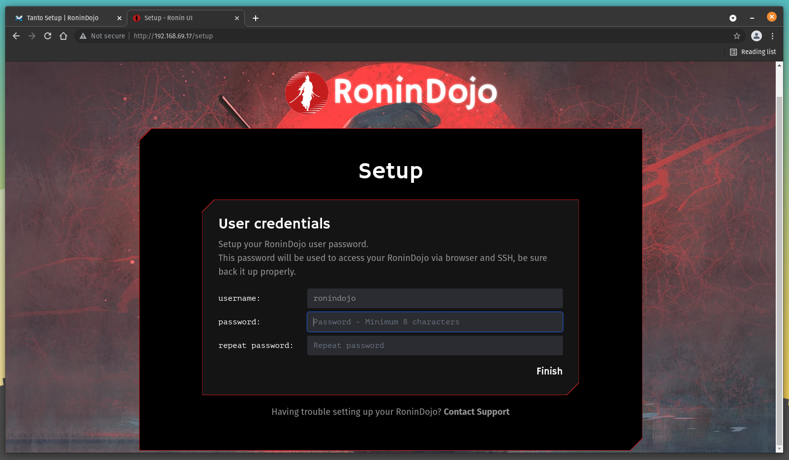
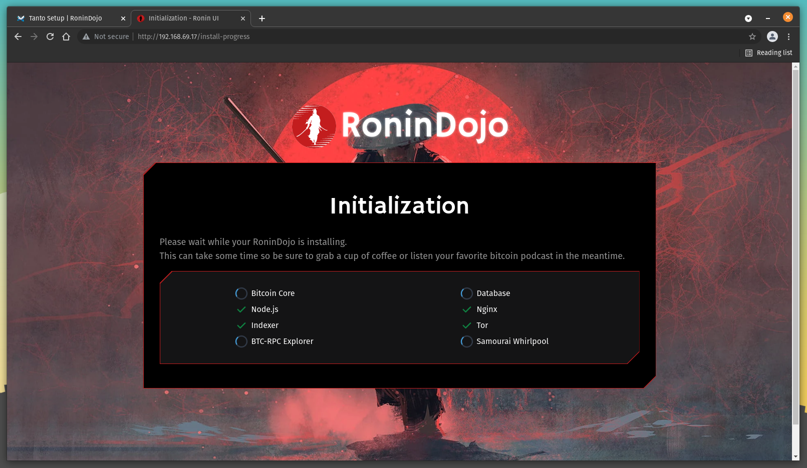
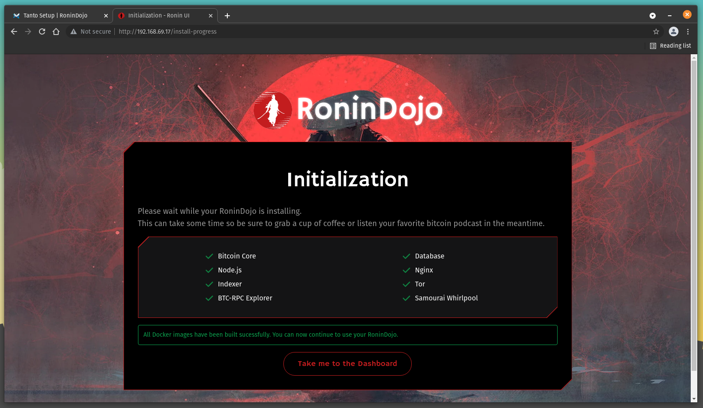
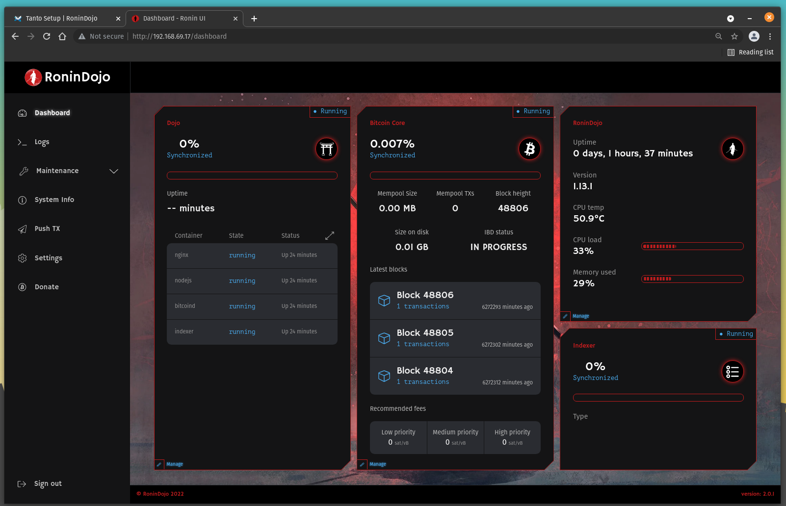

# Configuring
Configuring the Tanto is also very easy, it only takes a few minutes and the basic steps are to set your password then login. 

Visit the official [RoninDojo Wiki](https://wiki.ronindojo.io/en/setup/tanto-setup) for detailed instructions and more. 

  

Using a PC connected to the same local network as your Tanto, open your favorite web browser and type `https://ronindojo.local` into the URL bar. This should bring up the RoninDojo welcome page.

If that did not work, then you can achieve this same process by using the local IP address of your Tanto instead. This IP address can be found by logging into your router and checking the list of devices under the DHCP leases section. Your router should have the local IP address needed to login, along with the password on a label somewhere on the device. If not, the directions are usually pretty easy to find with an online search for your manufacturer's router. Typically, you can just type `192.168.0.1` or `192.168.1.1` or `10.0.0.1` into your web browser and that will bring you to your router login page. From there the username/password can vary depending on manufacturer but they are usually something like `admin/admin` or `admin/1234` or `admin/password`. Alternatively, programs like [AngryIP](https://angryip.org/) may be used.

In this example, the local IP address `192.168.69.17` is the one used to type into the URL bar. 

  

Once you are at the RoninDojo welcome page, select `Let's start`.

You will be presented with your Root credentials, these are like the master username and password for the Tanto's backend. Save these details in a secure place like a password manager and do not share these with anyone for any reason. You cannot change these, they are pre-selected for you. Ensure that you select the box that says `I have backed up Root user credentials`, then click on `Continue`.

  

Next, you will set your user credentials, these are the ones you will use to access the Tanto through the webinterface. The username is pre-selected for you, `ronindojo`. You can create any password you would like to use, just ensure it is at least 8 characters. Repeat this password and make sure you secure these credentials in a safe place like a password manager and do not share them with anyone for any reason. Then click on `Finish`.

  

Next, you will see several services such as Bitcoin Core, Node.js, Indexer, BTC-RPC Explorer, Database, Nginx, Tor, & Samourai Whirlpool start. This takes a few minutes. 

  

Once there is a green check mark next to each service, you can click on the `Take me to the Dashboard` button. 

  

Once you are at your dashboard, you can see the progress of the Bitcoin Initial Blockchain Download (IBD) and the vitals of your Tanto. The IBD will take about two days to complete, the Tanto is connecting to other Bitcoin nodes and downloading the entire Bitcoin blockchain all the back to the first block from January 2009. Once the IBD completes, you will have your own full copy of the blockchain and you will use your own copy to verify your transactions against.  

  

Some other vitals you can monitor are uptime, version, temperature, CPU load, and memory usage. Let this process run for a couple of days. Tanto will log you out automatically after some idle time but the processes continue to run in thebackground. 
