# Connecting Whirlpool
This section will demonstrate how to connect the Whirlpool desktop client to your Tanto full node and your Samourai Wallet. With this configuration, you will be able to have your UTXOs mixing non-stop in the backround from your desktop client and powered by your own full node. When you mix from mobile only, the mixing stops as soon as you shut down your mobile Whirlpool client in Samourai Wallet. 

First, you will need to download the Whirlpool client appropriate for your operating system. The different options along with accompanying developer signatures can be found [here](https://samouraiwallet.com/download) and detailed installation instructions can be found [here](https://docs.samourai.io/whirlpool/desktop). Be aware you will likely need to install Open JDK as well which is covered in the installation instructions. 

 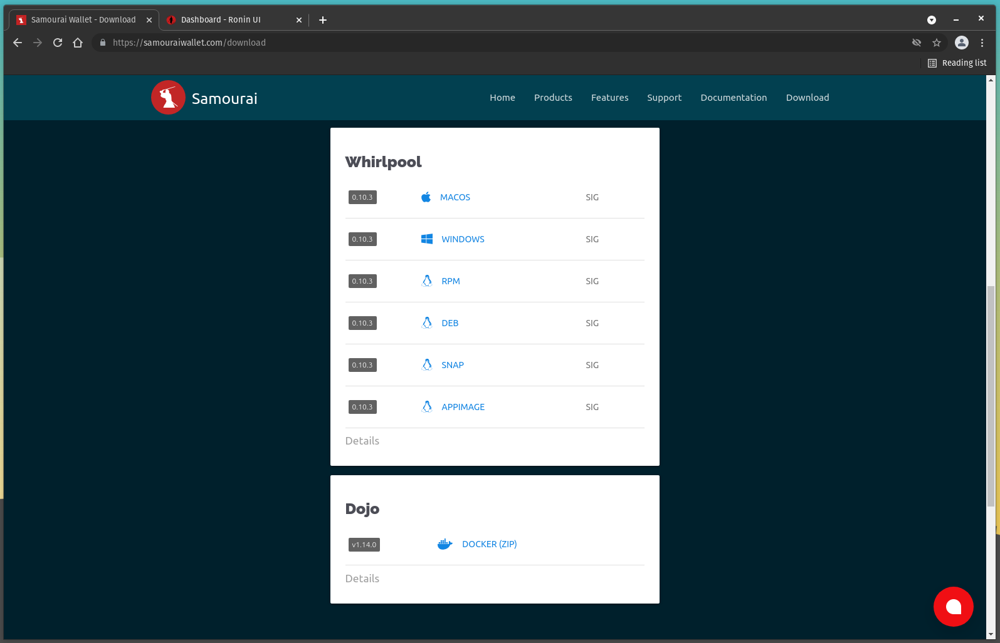

*In a future release of the RoninDojo UI, the Whirlpool URL will be available from the web interface dashboard and you will no longer need to retrieve this information from the terminal as demonstrated here.*  

Once you have your Whilpool client installed and your Samourai Wallet connected to your RoninDojo Tanto, you can make an SSH connection to the RoninDojo and start the Whirlpool service. The SSH connection can be made with the same username password you used for the RoninDojo UI.

Once connected, navigate to `Samourai Toolkit` > `Whirlpool`:

 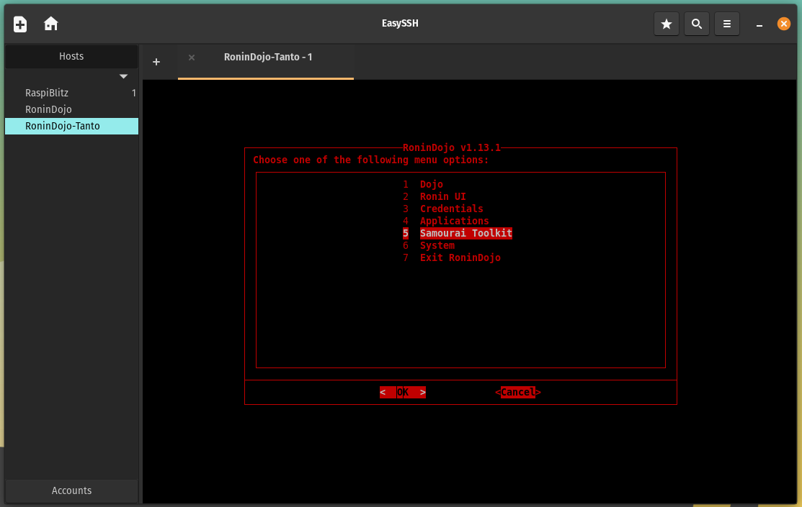
 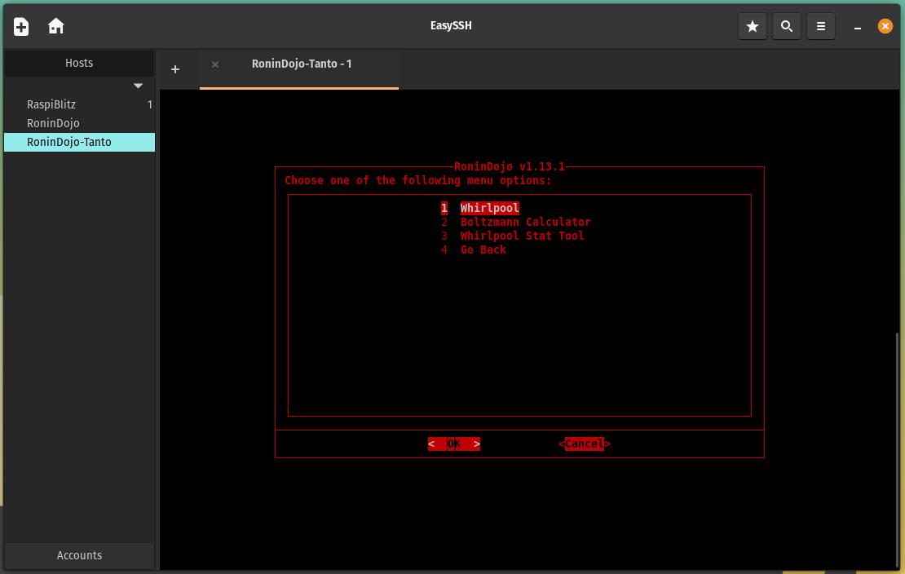

Then select `start`, a script will run briefly and then you can hit any key to return to the main menu when prompted. 

 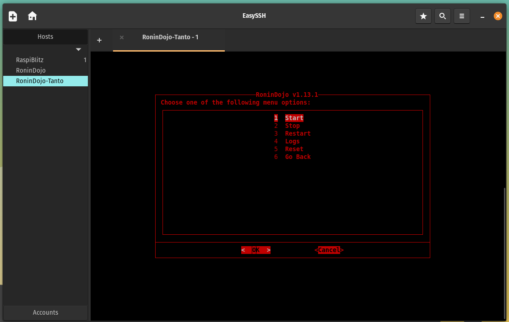
 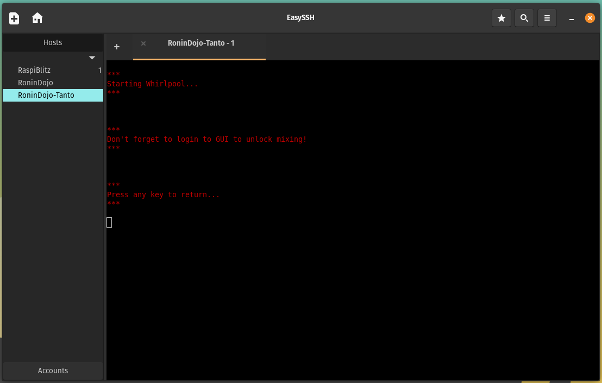

With the Whirlpool service started, and back at the main menu, now navigate to `Credentials` > `Whirlpool`

 
 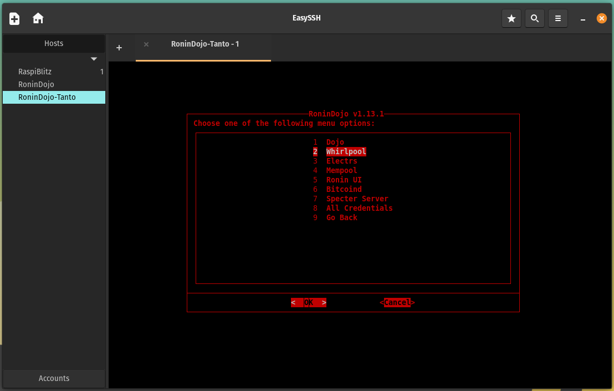

This is where you can retrieve the .onion URL you need to use in the Whirlpool client Graphical User Interface (GUI) to get it configured. Highlight this URL and use `ctrl+shift+c` to copy it to your clipboard. 

 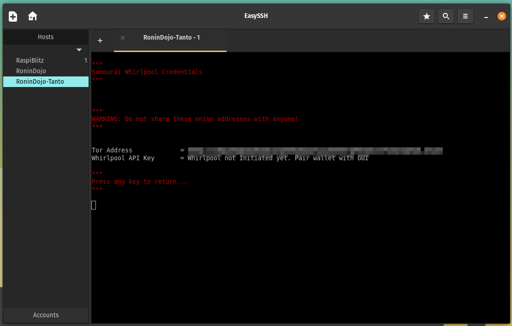

Now open the Whirlpool client application you installed earlier. Select the `Advanced: remote CLI` option and where it says `https://my-cli-host:8899` paste the .onion URL from your RoninDojo terminal. Depending on whether or not your are running a Tor daemon or just the Tor browser, you may need to select either `9050` or `9150` for appending the Tor proxy. Leave the API key blank, this will automatically be handled once initialized. Then click on `Connect`. 
 

 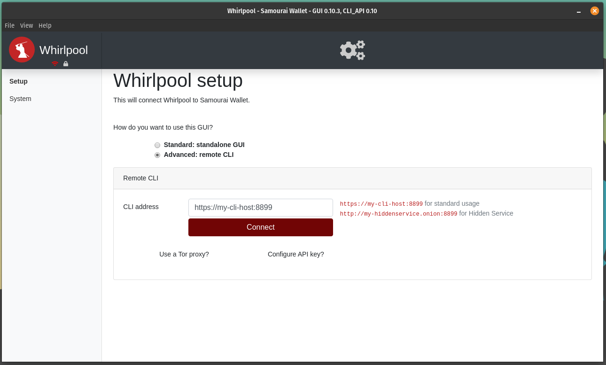

 

Give the GUI some time, Tor connections can take a little while. You may need to try this a couple times before the connection is made. But once the connection is made, you will be presented with a screen asking you to input the Whirlpool pairing payload from your Samourai Wallet. In Samourai Wallet, click on the 3-dot menu in the upper right-hand corner and select `Settings` > `Transactions` > `Pair to Whirlpool GUI` at the bottom. This will display a QR code that contains your Whirlpool payload. Simply click on the QR code option in the desktop GUI and this should launch your webcam then hold up the QR code on your mobile so the camera can scan it. 

 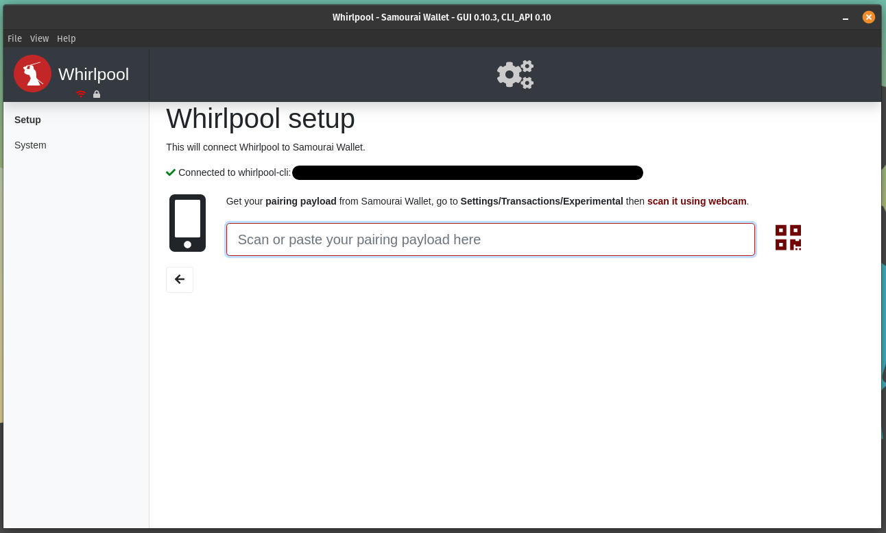

 

Once received, then click on `Initialize GUI`.

 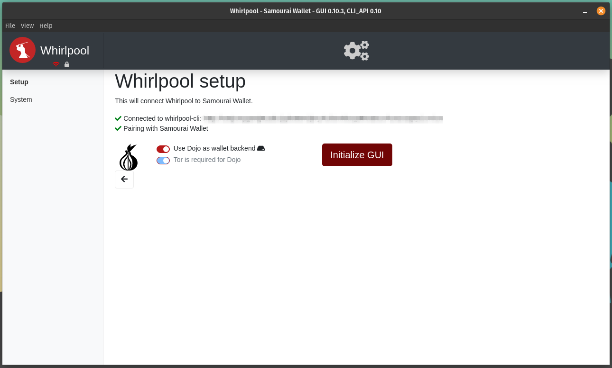

 

Next, enter the passphrase for your Samourai Wallet and click on `Sign in`.

 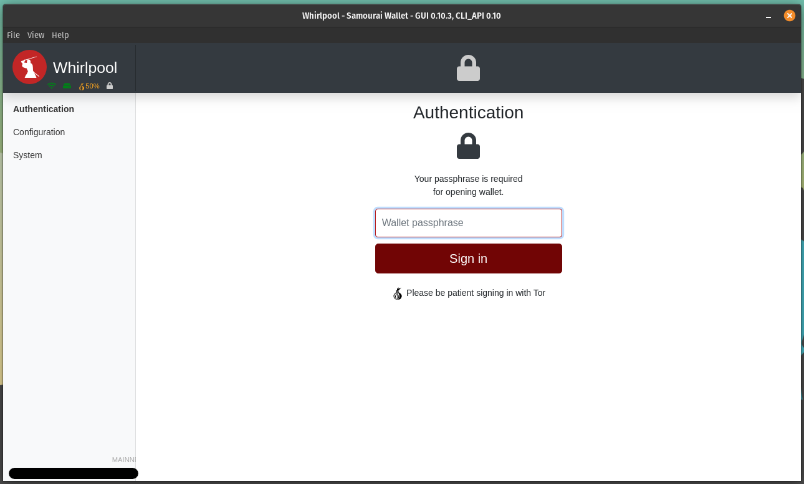

 

Once signed in, you should be able to see your balances, mixing activity, and then you can set targets for how many mixes you wish to achieve. You can even generate deposit addresses from the Whirlpool GUI.

 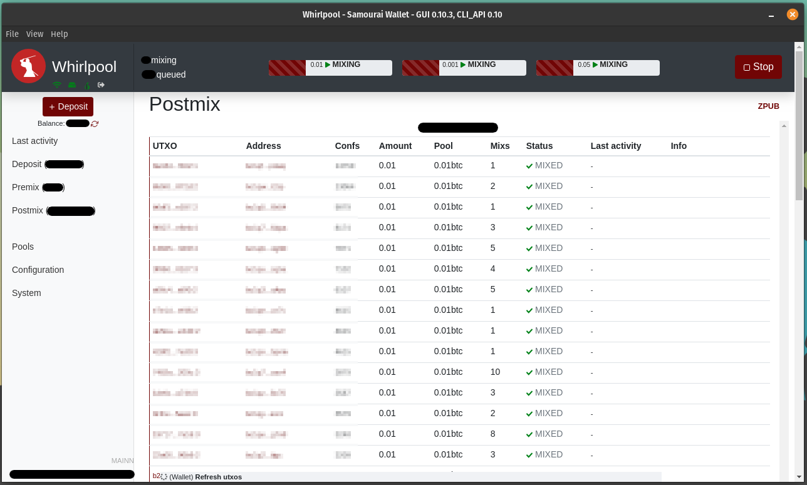

 

If you have received bitcoin that you would like to mix, simply follow these steps from your mobile Samourai Wallet:

- Select the blue `+` sign and then the `Whirlpool` button. 
- This will launch the mobile Whirlpool client, again select the `Whirlpool` button. 

 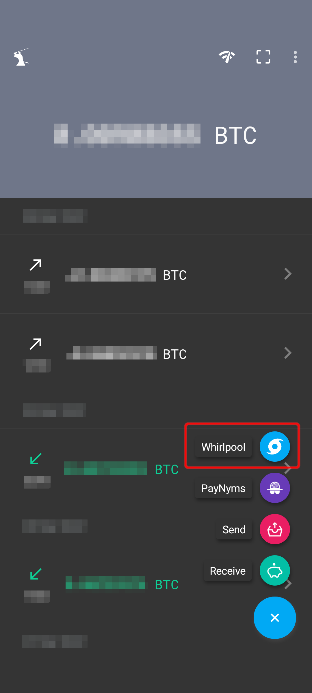
 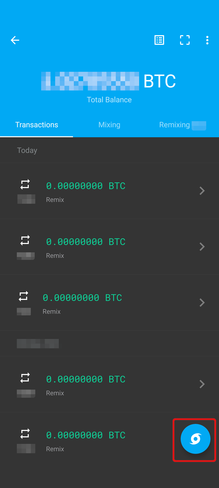

 

- Select the option to `Mix UTXOs`.  
- A list of the available UTXOs from your deposit wallet will be displayed. Select the UTXOs you would like to mix and then click on `NEXT`. Keep in mind, if any of these UTXOs have history that you do not want connected on-chain, consider selecting them independant of eachother. 

 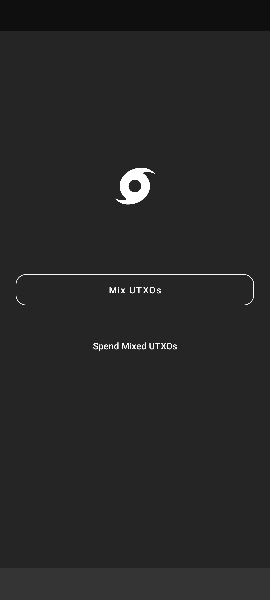
 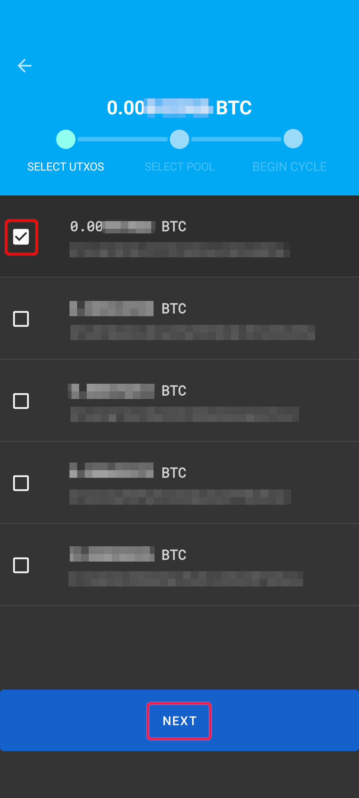

 

- Select the cycle priority (miners fee), select the pool size appropriate for the amount you are mixing, and select `REVIEW CYCLE DETAILS`. 
- You will be presented with the details of the TX0 you are about to make. Select `BEGIN CYCLE` once ready and the transaction will be built and then broadcast from your RoninDojo Tanto to the Bitcoin network. 

 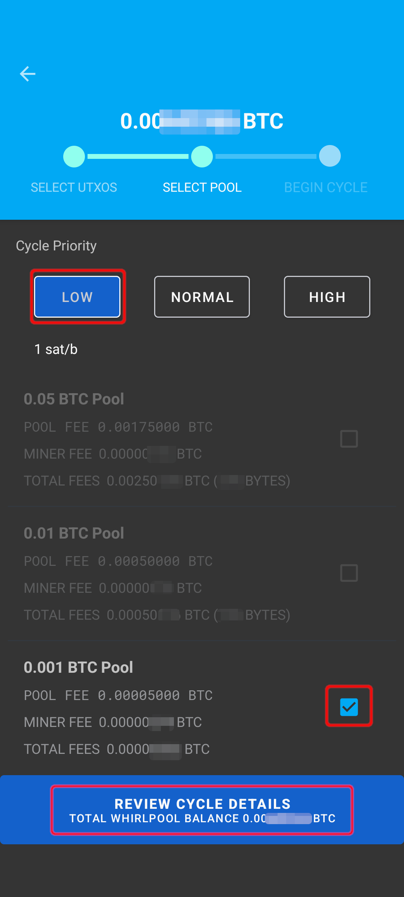
 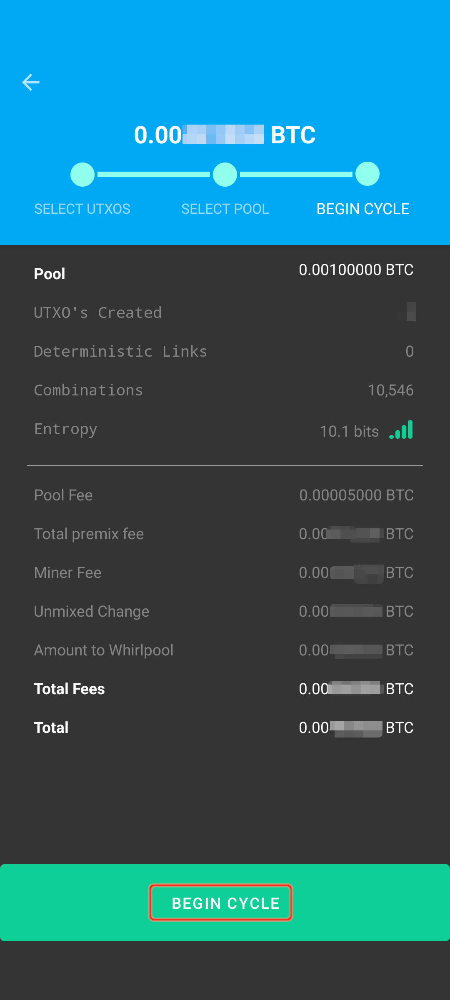

 

Now your resulting UTXOs from the TX0 will be registered as available inputs to new mixes, you can now close your mobile Samourai Wallet application and the desktop Whirlpool GUI will keep your resulting mix outputs available as free-riders for future mixing rounds. 
