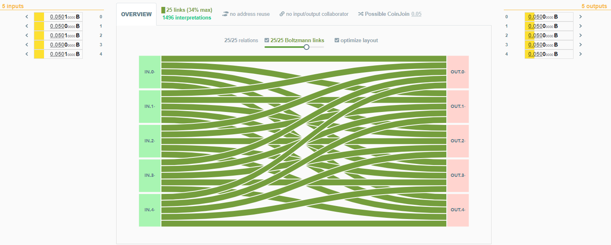
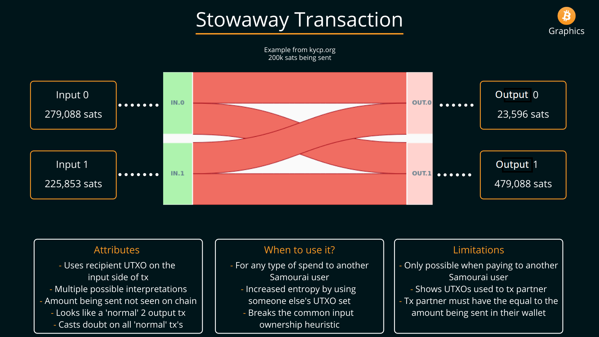
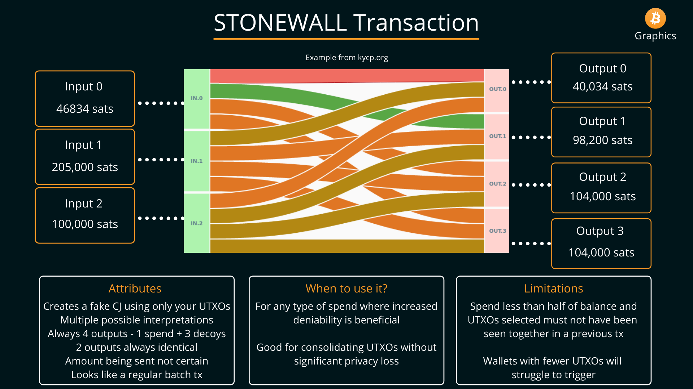
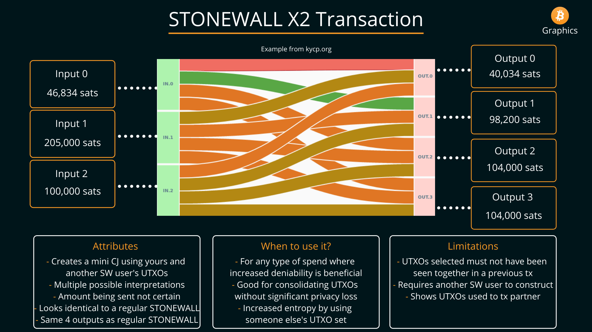

# Conclusion
Now you have seen how easy it is to connect and configure your own Bitcoin full node, how to install and configure a mobile Samourai Wallet, and how to connect them both to a desktop Whirlpool client. With this kind of setup you are able to bring the power of a ZeroLink CoinJoin implementation with you in your pocket while communicating back to your own node at home over Tor. You can also connect with peers to make collaborative transactions that preserve the anonymity gained in Whirlpool and break on-chain heuristics. 

## Whirlpool
Every Whirlpool transaction has 5 inputs and 5 equal-sized outputs. There is nothing about any particular output that makes it any more likely to belong to any particular input than any of the other outputs. 

There are strict rules that are enforced by the blinded Whirlpool coordinator such as:

- Each CoinJoin transaction will have 5 inputs.
- Each CoinJoin transaction will have 5 outputs.
- All of the outputs from a CoinJoin transaction will be the same denomination. 
- UTXOs do not cross from one pool to another, 0.05 BTC UTXOs do not get used as inputs in 0.01 BTC sized Whirlpool CoinJoin transactions for example. 
- That no single wallet may have more than one input to a transaction. So all 5 inputs must come from different wallets. 
- No two outputs from a CoinJoin transaction may be used together in a future CoinJoin transaction. 
- Every CoinJoin transaction will have a minimum of two fresh participants to the liquidity pool and a maximum of three.
- Every CoinJoin transaction will have a minimum of two re-mixing participants and a maximum of three. These participants may be referred to as "free riders".
- Fresh participants cover the miners fee. 
- Re-mixing participants continue mixing for no additional fee. 
- Only UTXOs from a previious CoinJoin transaction (free riders) or UTXOs from a Transaction Zero (TX0) (fresh participants) will be allowed as inputs. 

## Cahoots post-mix spendinig tools
Stowaway transactions are collaborative transactions made between the sender and receiver that obfuscate the amount being spent. Image credit: [@BitcoinQ_A](https://twitter.com/BitcoinQ_A)

A Stonewall transaction is attempted by default when spending from your post-mix wallet, this transaction looks identical on-chain to a collaborative StonewallX2 transaction. Image credit: [@BitcoinQ_A](https://twitter.com/BitcoinQ_A)

A StonewallX2 transaction looks identical on-chain to a Stonewall transaction but is made between two peers and can be spent to a third party. Image credit: [@BitcoinQ_A](https://twitter.com/BitcoinQ_A). Check out the econoalchemist guide on StonewallX2 transactions [here](https://www.econoalchemist.com/post/stonewallx2-a-privacy-enhancing-tool-from-samourai-wallet).

Check out the general guide on collaborative cahoots transactions by econoalchemist [here](https://www.econoalchemist.com/post/putting-the-who-in-cahoots). 

Collaborative cahoots transactions are made with PayNyms, each instance of Samourai Wallet gets a unique PayNym. PayNyms can send messages to each other to build these collaborative transactions over the Soroban comms layer which is encrypted over Tor by default. [Sparrow Wallet](https://www.sparrowwallet.com/) has also implemented Whirlpool, PayNyms, and BIP47. So even if you do not have an Android mobile, you can still gain access to these powerful privacy tools by installing Sparrow Wallet on your PC.  

  
  

Being able to makes these kinds of transactions from a mobile wallet or desktop wallet that communicates back to your own Bitcoin full node, the Tanto, over Tor is a massive step toward guarding your privacy, being your own bank, and using the best privacy tools available today for your Bitcoin transactions. 

To learn more about RoninDojo and to order your Tanto, visit their website [ronindojo.io](https://ronindojo.io/). When you want FOSS software with a laser focus on privacy, this is the sharpest tool available for your toolbox. 
