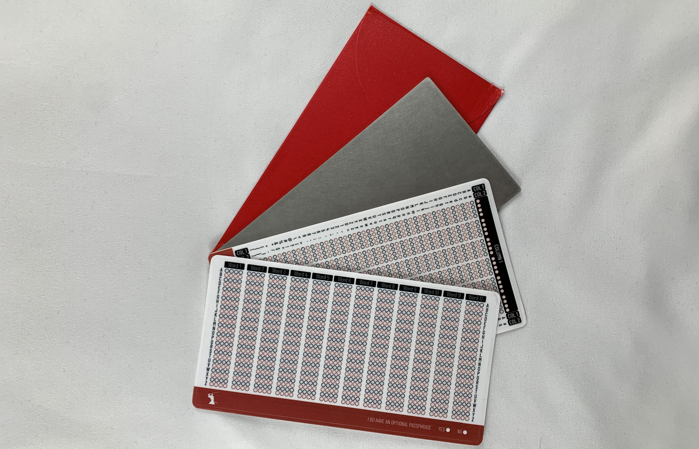
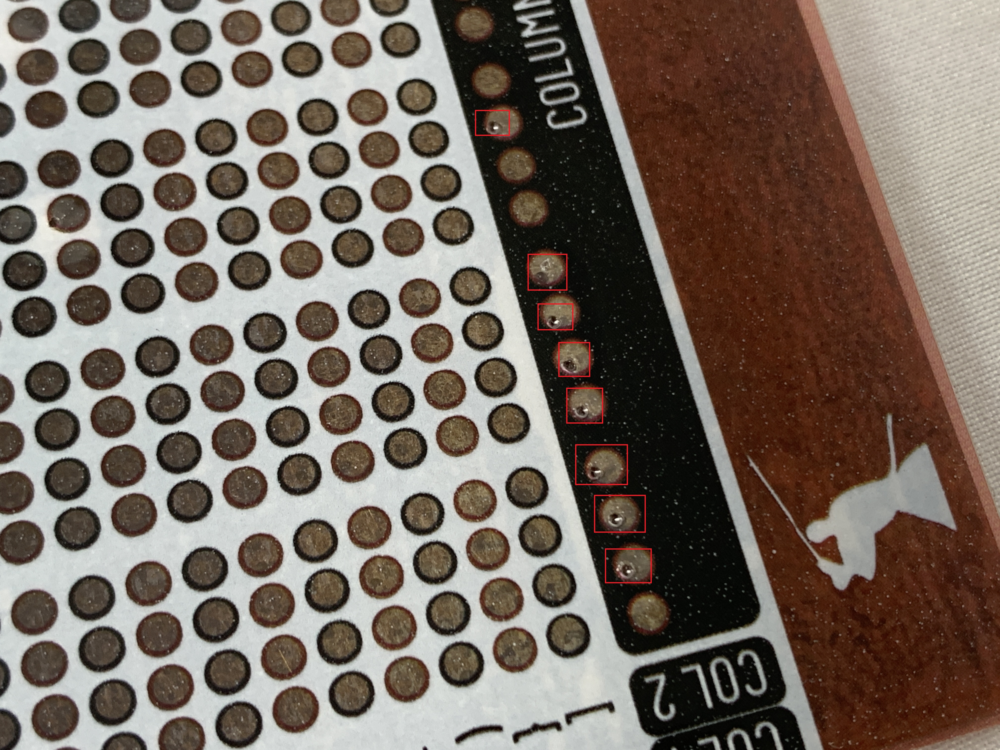

# RoninDojo-Tanto Guide
If you are not running your own Bitcoin node then you are trusting someone else's. RoninDojo is a FOSS developer team focused exclusively on building the most stable and tailored full node for [Samourai Wallet](https://samouraiwallet.com/) support. With Samourai Wallet and RoninDojo combined, users are empowered with a mobile-first Bitcoin wallet that features privacy-enhancing tools like a Whirlpool CoinJoin implementation and post-mix collaborative spending tools; all powered by the user's own self-hosted Bitcoin full node communicating with the mobile client over Tor. This guide demonstrates setting up a new plug & play full Bitcoin node from [RoninDojo](https://ronindojo.io/) called the Tanto.

  
 

 
The Tanto comes pre assembled and pre-loaded with the RoninDojo software, there is no need to build a material list and order several pieces of hardware from multiple vendors. The Tanto features a milled aluminum case and the fanless design makes this the quietest node you'll ever run. The outer case is painted black with a sleek RoninDojo logo in red. Inside the case, the Tanto is powered by a RockPro64 board, an interface card, and an M.2 NVMe 1TB SSD. The Tanto also includes a 32GB microSD card pre-loaded with the RoninDojo software image and power supply. Everything you need to get started is included. 

All together the Tanto includes:

- Aluminum case & bottom plate
- Ronin X4-90 adaptor
- LED stripe with GPIO connectors (upgraded to multi-color PCB board LED with batch 2)
- Thermo pad, rubber feet, screws, & hex wrench
- RockPro board
- RockPro64 PCIe X4 to M.2/NGFF NVMe SSD interface card
- Power supply
- M.2 SSD M-key, 1TB
- 32GB microSD card
- RoninSteel backup kit
- Spring loaded punch
- Ethernet cable
- Sticker pack
- "Thank you" card

  
  

There are a couple of upgrades in the works for both the Tanto hardware and the RoninDojo UI software:

- The URL for the Whirlpool GUI will be available through the dashboard web interface so that you no longer have to access it through the SSH terminal. 
- The LED strip installed on the front of the Tanto will be upgraded to a custom LED PCB board which features not only the current red color but also green and blue to offer different kinds of status indicators in future releases. This upgrade will be included in all batch 2 Tantos. For batch 1 Tanto owners, this upgrade will be shipped free of charge. Here is what the upgraded LED PCB board will look like, the final product will be colored black to match the Tanto:

 
  
  

Additionally, the Tanto includes the RoninSteel stainless steel seed phrase back up plate. Check out [this guide](https://bitcoinmagazine.com/guides/how-to-bitcoin-seed-backup-roninsteel) to see a demonstration of the RoninSteel. Here are a few highlights to give you an idea of what it is and how it works. 

Each RoninSteel kit includes the blank steel plate, multiple template stickers for the seed phrase and passphrase (one for each side of the plate). The characters can be marked with permanent marker first and then stamped with the included spring-loaded punch. 

  
  
 

 
 

  
  
 

 
Then the sticker can be peeled off so that the information stamped on the plate is unknown with out using another template sticker for the recovery process. This way if anyone finds your backup plate then they will not know the information it contains. 
 
 

  
  
 
 
 
 There is also a tamper evident envelope included so you can rest assured no one has accessed the plate. The plate is also subjected to a fire test in the full guide. 
  

  
  
 
 
